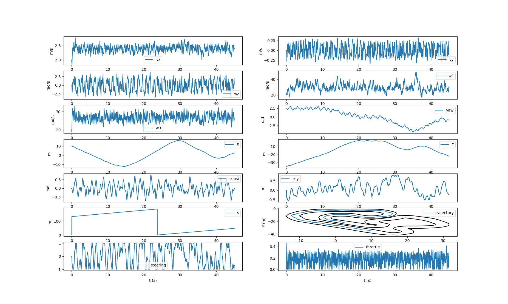
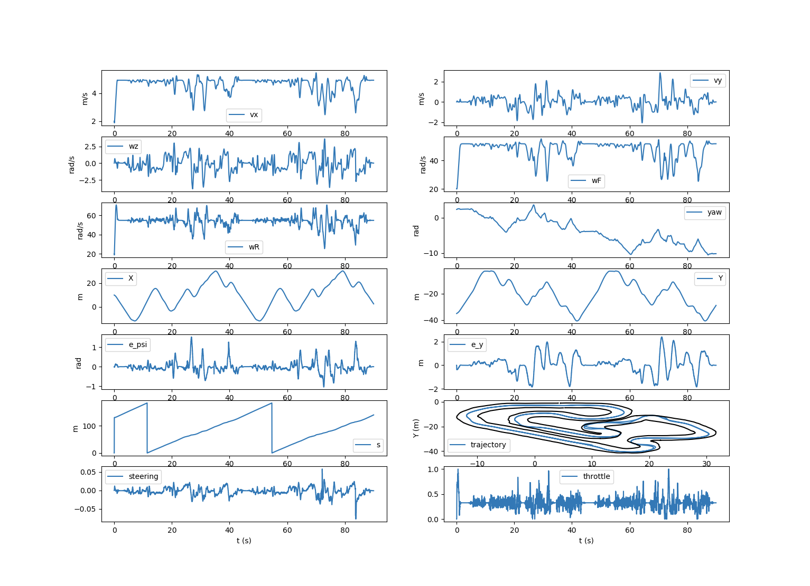
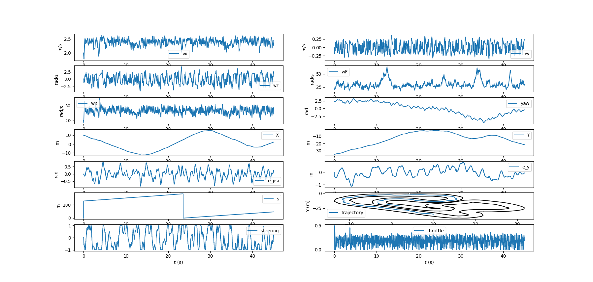
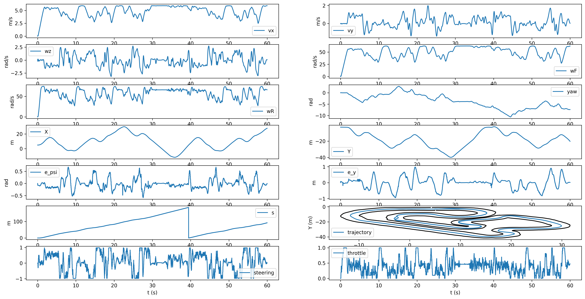

# Design Notebook for [Active Safety for Autonomous and Semi-Autonomous Vehicles](https://www.vip.gatech.edu/teams/active-safety-autonomous-and-semi-autonomous-vehicles)
- [Georgia Tech Vertically Integrated Project (VIP)](https://www.vip.gatech.edu/) - Spring 2021
- Lead: Dr. Panagiotis Tsiotras - tsiotras@gatech.edu
- Name: Ahmed Khalaf - ahmed.khalaf@gatech.edu
- *Subteam*: [AutoRally](https://autorally.github.io/)#2 (MPC motion planning) - Subteam lead: Jacob Knaup - jacobk@gatech.edu

### Before: Starting point (Feb 2021)
<iframe width="560" height="315" src="https://www.youtube-nocookie.com/embed/4J7w1VV7CNU" title="YouTube video player" frameborder="0" allow="accelerometer; autoplay; clipboard-write; encrypted-media; gyroscope; picture-in-picture" allowfullscreen></iframe>

### After: [Spoiler Alert!] Results on more complex Race track (Dec 2021)
After introducing multi-shot receding horizon control with safety hard constraint.
<iframe width="560" height="315" src="https://www.youtube.com/embed/1ms5fctfAYs" title="YouTube video player" frameborder="0" allow="accelerometer; autoplay; clipboard-write; encrypted-media; gyroscope; picture-in-picture" allowfullscreen></iframe>

# Progress log

# Jan, 26

## Team event: Subteams assigned

# Jan, 27

## Subteam event: First subteam meeting.
## Todos
  - Build autorally public repo locally
  - J. Knaup to send over a paper and code for the LTV MPC controller
  - material and code to be studied

# Jan, 28

Collected materials to study until more concrete stuff is available from Jacob.

## Review MPC section from my Self-Driving car nanodegree material

https://www.udacity.com/self-driving-car

Notes: MPC controls both acceleration and steering based on Waypoints from traj. planning node.

Code: https://github.com/udacity/CarND-MPC-Project

## Self-study material references:

### Melanie Zeilinger: "Learning-based Model Predictive Control - Towards Safe Learning in Control"

Institute for Pure & Applied Mathematics (IPAM) - Intersections between Control, Learning and Optimization 2020

Notes:
* very interesting lecture, TODO: what's GP and QP?
* learning part used for parameters could be Deep-learning or similar
* physics first-principles part for control and constraints
* MPC controller gets contraints (hard) from evnironment --> safety

Lecture video: https://www.youtube.com/watch?v=nO8r8XKlPgA&ab_channel=InstituteforPure%26AppliedMathematics%28IPAM%29

### Model Predictive Contouring Controller (MPCC) for Autonomous Racing developed by the Automatic Control Lab (IfA) at ETH Zurich
Notes:
 1. C++ implementation, Matlab Simulation
 2. Solver runs on remote PC, not embedded in the car
 3. algorithm seems similar to what jacob described

Video: [ORCA - Nonlinear MPCC "How it works"](https://www.youtube.com/watch?v=QWY7sV9sjkA)
Code: https://github.com/alexliniger/MPCC

# Feb, 5
Received code and paper [Falcone, 2007](https://doi.org/10.1109/CDC.2007.4434137) from J. Knaup

Notes:
- Implementation is in Matlab. Check how we get this running in the car? Autocoder?
- Paper mentions tire fricition, how do we estimate that at runtime?
- TODO: Install matlab and refresh
- TODO: Find material on MPC design in matlab

# Feb, 7

## Self-study material references:

### MPC Implementation workshop by Mohamed W. Mehrez, PhD

Notes:
* Single shot vs. multishot
* Constraints are tricky to get right
* Optimizer might get stuck, approximate vs. exact?

Code: https://github.com/MMehrez/MPC-and-MHE-implementation-in-MATLAB-using-Casadi/tree/master/workshop_github

Full playlist:

### Mathworks Matlab MPC toolbox

Notes: Very nice short video series to get started with MPC basics
[Video playlist](https://www.mathworks.com/videos/understanding-model-predictive-control-part-1-why-use-mpc--1526484715269.html)

#### Matlab Documentation mainly, but still some generic MPC concepts are well-explained

[MPC Toolbox](https://www.mathworks.com/help/mpc/getting-started-with-model-predictive-control-toolbox.html?s_tid=CRUX_lftnav)
About MPC:
* [MPC Modeling](https://www.mathworks.com/help/mpc/gs/mpc-modeling.html)
* [MPC - Optimization Problem](https://www.mathworks.com/help/mpc/ug/optimization-problem.html)
* [MPC - QP Solvers](https://www.mathworks.com/help/mpc/ug/qp-solver.html)

# Feb, 9
TODO
- Check with Jacob what does Matlab code has to do with Autorally?
- Review with Jacob understanding of [Falcone, 2007](https://doi.org/10.1109/CDC.2007.4434137)

# Feb, 10

## Subteam event: meeting with J. Knaup
- Code is just to understand MPC
- Actual MPC for us will be in C++ ROS node for high-level planning .. low level controllers for motors ..etc are out of scope 
- NN used for system identification
- TODO: Run simulation and inform Jacob when ready

# Feb, 14

- ROS installation in VMware is too slow, build another VM with GPU HW acceleration.
- Gazebo crashes in VMware with GPU HW acceleration!
- TODO: check how to run GUI applications, Gazebo and RQT seem to be required
- container is faster but several configuration issues to get GPU accelration for MMPI controller
- TODO: try VM on more powerful computer

# Feb, 15

## Team event: bi-weekly team meeting
- Current LTVMPC implementation drives fine on Marietta track, but slow on CCRF track.
- I will be working on tuning MPC controller in order to drive faster on CCRF track.
Notes
- TODO: Find out if I can run simulation locally?
- TODO: What's the difference bet. Marietta and CCRF tracks?
- TODO: Prepare status slides for meetings in the future.

# Feb, 16

## Todo: how to formulate faster progress on the track? traj. tracking?

### Self-study material references:
* [Christ et al., 2019](https://doi.org/10.1080/00423114.2019.1704804) Time-optimal trajectory planning for a race car considering variable tyre-road frictioncoefficients, Vehicle System Dynamics
* [CHEN et al., 2020](https://doi.org/10.1007/s11771-020-4561-1) MPC-based path tracking with PID speed control for high-speed autonomous vehicles considering time-optimal travel
* [Kapania et al., 2016](https://doi.org/10.1115/1.4033311) A Sequential Two-Step Algorithm for Fast Generation of Vehicle Racing Trajectories
* [Verschueren, 2015](https://doi.org/10.1109/CDC.2014.7039771) Towards time-optimal race car driving using nonlinear MPC in real-time
* [Velenis,  E.,  and  Tsiotras,  P.,  2008](https://doi.org/10.1007/s10957-008-9381-7) Minimum-timetravel for a vehicle with acceleration limits: Theoretical analysis and receding-horizon implementation

TODO: review papers and send them to Jacob for discussion

# Feb, 19

New info from Jacob:

- For what we are doing, you don’t need to run Gazebo or MPPI
- Code not available in public repo (Not the MPPI Controller)
- New code repos provided as archives (snapshot from working stuff on Jacob's side)
- TODO: build Autorally-private in same catkin workspace with Autorally repo

# Feb 20

- Building private code fails
- Error CMAKE_CUDA_DEVICE_LINK_EXECUTABLE --> What do we need GPU for?
TODO:
* Check with Jacob reg. dependencies, compiler version ..etc

# Feb, 23

Managed to run the code from Jacob, LTVMPC results look really sad

# Feb, 26

## Subteam event: meeting with Jacob

Notes:
- No need to push to repo for now (strange!)
- Target speed 5m/s doesn't work. Set target speed 2.5m/s
- TODO: Join slack channel
- TODO: Provide several runs with target speed 2.5m/s to Jacob
- Not sure why trajectory isn't optimal even if target speed is low and weight of error in y = 0? TODO: Investigate 
- Discussed proposals for progress toward time-optimal:
  1. Tracking a certain target speed isn't important - Agreed
  2. Tracking distance from center lane isn't important - Agreed
  3. Change model into time-independent model (like [Verschueren, 2015](https://doi.org/10.1109/CDC.2014.7039771) ) - Jacob not sure it's a good idea, seems too much work and we linearize anyway
  4. I proposed trying to add change parameters/cost function to memics the same effect (emphasis on distance traveled)

Results are much better with speed set point 2.5m/s

# Mar, 1

## Team event: bi-weekly team meeting
- TODO: maintain environment/dependencies installation steps in prep_env.sh
- Feedback from J. Knaup, performance baseline with 5m/s is better than my screenshots, controller might be running slow (simulation and code run in realtime not sim time)

# Mar, 2

- TODO: Deep dive into the implementation
- Seems we're using CVXGEN, apply for educational license

# Mar, 4

- Changing problem formulation in CVXGEN to maximize travel on the track, still unstable results despite contraint on lateral position to be within track width.
- Seems the scope of work will go beyond parameter tuning
- TODO: review MPC and Optimization material
- TODO: modify speed based on curvature? (increase in straight sections, decrease in acute curved sections)
- TODO: check where targets are coming from to the solver?

# Mar, 12

Notes on expirement with agressive target S

* Adding target on state variable (s) improves results are getting better (faster), but still unstable
* Target is calculated with curvature speed modifier (TODO: not sure this is a good idea, can be confusing to the solver?)
* Increasing the weight of target S improves speed as expected (since S is calculated with more agressive speed in straight sections?)

* TODO: review with Jacob what might be the reason
* TODO: expirement with extreme cases (target speed very low/high, on straight/acute section ..etc) in order to identify root cause
* TODO: include results and explaination in slides for Monday meeting.

Simulation Result with cost function weight 5.0 on Vx only:

Simulation Result with cost function weight 5.0 on Vx and 1.0 weight on S

Simulation Result with cost function weight 3.0 on Vx and 1.0 weight on S

# Mar, 13

- TODO: expirement with multishot rather than single-shot

# Mar, 15

## Team event: bi-weekly team meeting
- presented LTVMPC_CW.pptx, no major comments
- TODO: Prof. asked for better visualization (track top-view)

# Mar, 16

Notes from expirements:

- Adding target on difference of initial and terminal state variable (s) might be better than a single target for the whole horizon, TODO try it?
- Setting terminal cost to zero improves the unstable/strange results
- From [J. Mattingley, Y. Wang and S. Boyd, 2010](https://stanford.edu/~boyd/papers/pdf/rhc_aut_gen_solvers.pdf) Receding Horizon Control AUTOMATIC GENERATION OF HIGH-SPEED SOLVERS:
> For some problems, stability guarantees can be obtained by adding specific terminal costs and constraints. *Terminal costs and constraints also allow simpler, shorterhorizon controllers to approximate the behavior of controllers with longer horizons.*
- TODO: discuss how important is it with Jacob.

# Mar, 17

## Subteam event: meeting with Jacob
- TODO: push changes to autorally private repo, Nolan shall provide access

# Mar, 20

Updated CVXGEN to multishot and cost term for dS = quad((Sterminal_target - Sinitial_target) - (Sterminal - Sinitial))

Notes from simulation expirements with multi-shot

* Speed isn't greatly improved compared to baseline but faster than target S and better handling and stays in track than both
* Simulation with with multi-shot + dS term doesn't yield faster result, TODO: additional tuning needed?
* TODO: make all options (weights for State variables, Terminal stats, dS ..etc) available as configuration parameters for better expirementation

Simulation Result multishot:

Simulation Result multishot + dS term:

# Mar, 29

## Team event: bi-weekly team meeting
- presented LTVMPC_CW2.pptx, no major comments
- J. Knaup commented: too wiggly, TODO: meet to discuss what's causing that
- TODO: provide the modifications directly, for some reason it's not possible to get write access

# Apr, 1

Provided snapshot of code, simulation data: param configuration and results

https://drive.google.com/file/d/1xYH4obNJ-CdsZgzQLf75BU93-yluHrvm/view?usp=sharing

# Apr, 12

Seems execution time impacts the output greatly, TODO: rebuild envirnoment on a Core-i7 machine with clean ubuntu install to confirm.

Jacob created a private repo:
https://github.gatech.edu/jknaup3/autorally_private-ahmed

TODO: clone and sync with this one

# Apr, 14

## Subteam event: meeting with Jacob
- Jacob: curvature map is not the right one for CCRF
- TODO: calculate curvature instead of using the map

# Apr, 19

- TODO: Use Heron's formula, calculate curvature for each S from 3 points (actual point one before and one after)
- K = 4 * Area / ABC where A,B,C are the triangle side lengths
- Ref. from Jacob for X,Y -> S,n calculations : https://ieeexplore.ieee.org/abstract/document/8317775

# Apr, 20

- Curvature calculation will not be smooth using raw data
- TODO: Try another optimization based curve fitting approach with segments with min of 3 points and 5m or 4m?

Much better results!

CCRF map ~ 5m sections:

- TODO: Generate optimal (min curvature, min time ..etc) racelines offline and use as target
- TODO: Try this code, looks good but doesn't seem to be time-optimal

[deepracer-k1999-race-lines](https://github.com/cdthompson/deepracer-k1999-race-lines/)

> https://github.com/cdthompson/deepracer-k1999-race-lines/

> | Original Track | Calculated Race Line | Numpy coordinates |
> |----------------|----------------------|-------------------|
> |  |  | NumPy:&nbsp;[Canada_Training](racelines/Canada_Training-1000-4-2019-10-11-163418.npy) Python&nbsp;Code:&nbsp;[Canada_Training.py](https://raw.githubusercontent.com/cdthompson/deepracer-k1999-race-lines/master/racelines/Canada_Training-1000-4-2019-10-11-163418.py) |
> |  |  | NumPy:&nbsp;[reinvent_base.npy](racelines/reinvent_base-400-4-2019-10-11-161903.npy) Python&nbsp;Code:&nbsp;[reinvent_base.py](https://raw.githubusercontent.com/cdthompson/deepracer-k1999-race-lines/master/racelines/reinvent_base-400-4-2019-10-11-161903.py) |
> |  |  | NumPy:&nbsp;[reinvent2019.npy](https://raw.githubusercontent.com/cdthompson/deepracer-k1999-race-lines/master/racelines/reInvent2019_track-1000-4-2019-11-09-113228.npy) Python&nbsp;Code:&nbsp;[reinvent2019.py](https://raw.githubusercontent.com/cdthompson/deepracer-k1999-race-lines/master/racelines/reInvent2019_track-1000-4-2019-11-09-113228.py)

# Apr, 23

* Raceline isn't very different from centerline!
* TODO: add max velocity as constraint for CVXGEN
* Equation from [Velenis,  E.,  and  Tsiotras,  P.,  2008](https://doi.org/10.1007/s10957-008-9381-7): Vmax =  Fn_max * sqrt(R/m)
* TODO: what component can calculate Fn_max for the controller? (for now add it as a configurable parameter)

# Apr, 24

* TODO: generate reference track for [TUMFTM](https://github.com/TUMFTM) / [global race trajectory optimization](https://github.com/TUMFTM/global_racetrajectory_optimization)

# Apr, 25

- TODO: commit all changes and merge with Jacob's new map.
- Good results from Jacob with new curvature values

## Results on J. Knaup's machine - target velocity 5 m/s:

Weights: default baseline - Terminal weight = 0

## Results on J. Knaup's machine - target S:

Most imp. weights: 

| Vx | 0 |
| Vy | 0.1|
| ey | 0.1|
| Terminal S | 50000 |
| Terminal others | weight * 1000 |

# Apr, 26

- Re-generate results from clean repo to ensure nothing was missed, closedown.
- All Weights: default baseline - Terminal weight = 0

## Target speed 5 m/s without Vmax constraint

## Target speed 5 m/s with Vmax constraint (Fn_max = 10.0)

## Target speed 6 m/s with Vmax constraint (Fn_max = 10.0)

## Conclusion

* Scope of work expanded significantly compared to original goal, but was great learning experience
* Main goal achieved: LTVMPC controller can achieve much faster lap times now, with improved options for expirementation and tuning
* Further work can make use of offline raceline optimzation
